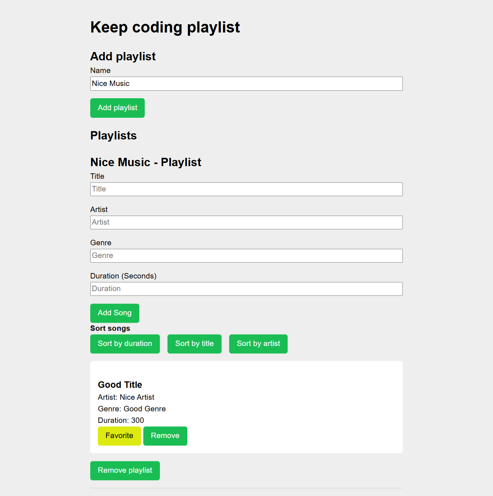

# Abgabe des Projekts "Einführung in JavaScript"

**KeepCoding-Projekte – Web 18**  
Siehe die vollständige Liste der Repositories und Beschreibungen in [repos-kc-web-18.md](https://github.com/pablo-sch/pablo-sch/blob/main/docs/repos-kc-web-18.md)

## Wähle deine Sprache

- 🇺🇸 [Englisch](README.md)
- 🇪🇸 [Spanisch](README.es.md)

<!-- ------------------------------------------------------------------------------------------- -->

## Ziel des Projekts

Dieses Projekt hat das Ziel, die in den virtuellen Kursen erworbenen Kenntnisse zu vertiefen und anzuwenden, indem grundlegende JavaScript-Konzepte als Einführung in die Webprogrammierung genutzt werden. Es ist nicht erlaubt, externe JavaScript- oder CSS-Bibliotheken bzw. Frameworks zu verwenden; alles muss mit „Vanilla JS“ gelöst werden. Auf diese Weise spiegelt jede Aufgabe genau das wider, was im Unterricht besprochen wurde, und bietet eine praxisorientierte Einführung in die Webentwicklung.

<!-- ------------------------------------------------------------------------------------------- -->

## Beschreibung

In diesem Repository findest du die Übungsaufgaben der Einheit **„Einführung in JavaScript“**. Es enthält sechs Aufgaben, die folgende Themen abdecken:

- **Strings**, **Arrays**, **Objekte** und deren Eigenschaften
- Umgang mit **Asynchronität** und **Destrukturierung**
- Erstellen und Verwenden von **Funktionen**
- Array-Methoden wie **`.map`**, **`.find`** und **`.filter`**
- Ein kleiner Satz von Unit-Tests am Ende der Aufgabe 06

Jede Aufgabe muss ohne Abhängigkeit von externen Bibliotheken oder Frameworks gelöst werden, um das Verständnis für die Kernsyntax und -techniken von JavaScript zu stärken.

<!-- ------------------------------------------------------------------------------------------- -->

## Erlernte und Geübte Kenntnisse

| **Kategorie**                  | **Unterthemen / Details**                                                                                                                                                                         |
| ------------------------------ | ------------------------------------------------------------------------------------------------------------------------------------------------------------------------------------------------- |
| Einführung in JavaScript       | –                                                                                                                                                                                                 |
| Syntax und Variablen           | Grundlegender Aufbau einer Datei; reservierte Wörter; Kommentare; Variablendeklaration (`let`, `const`, `var`); Semikolon                                                                         |
| Datentypen                     | Primitives; Zahl (`42`, `3.14159`); Zeichenkette (`"Howdy"`); Boolean (`true`, `false`); `null`; `undefined`; BigInt (`9007199254740992n`); Objekt; Werte ungleich 0, `0`, `null` und `undefined` |
| Operatoren                     | `typeof`; Zuweisungsoperatoren; arithmetische Operatoren; Vergleichsoperatoren; Zeichenkettenoperatoren; logische Operatoren; Kommaoperator                                                       |
| Kontrollstrukturen und Blöcke  | –                                                                                                                                                                                                 |
| Bedingte Ausdrücke (`if…else`) | –                                                                                                                                                                                                 |
| Blöcke                         | –                                                                                                                                                                                                 |
| Hoisting                       | –                                                                                                                                                                                                 |
| `switch`                       | –                                                                                                                                                                                                 |
| Ternärer Operator              | –                                                                                                                                                                                                 |
| „Truthy“-Werte                 | Zahlen ungleich 0; Zeichenketten ungleich `""`; Objekte; Funktionen                                                                                                                               |
| „Falsy“-Werte                  | `false`; `0`; `""` oder `''`; `null`; `undefined`; `NaN`                                                                                                                                          |
| Zeichenketten und Arrays       | Methoden für Zeichenketten: `trim()`, `toLowerCase()`, `includes()`, `replace()`, Parsing; Fehlerbehandlung; Methoden für Arrays; zweidimensionale Arrays                                         |
| Funktionen                     | Funktionsdeklaration; Arrow-Funktionen; Funktionsaufruf; Gültigkeitsbereich (Scope); Closures; Standardparameter; Rest-Parameter                                                                  |
| Schleifen                      | `for`; `while`; `break` und `continue`; `for…in`                                                                                                                                                  |
| Objekte                        | Objekterstellung; Zugriff auf Eigenschaften; Eigenschaften ändern; Eigenschaften hinzufügen; Eigenschaften löschen; Iteration mit `for…in`                                                        |
| Mutabilität                    | Mutierbare Objekte und Arrays; Spread-Operator (`...`); Destrukturierung; Referenzprobleme                                                                                                        |
| Funktionale Programmierung     | Callback-Funktionen; `forEach`; `map`; `filter`; `reduce`                                                                                                                                         |
| Asynchronität                  | Asynchrone Callbacks; Promises (`Promise`); `async` / `await`                                                                                                                                     |
| Zusätzliche Themen             | Datumsobjekte (`Date`); reguläre Ausdrücke (RegEx); Module (ES Modules)                                                                                                                           |

<!-- ------------------------------------------------------------------------------------------- -->

## Projektdetails

### Hinweis

- Die Aufgabenstellungen und der gezeigte Code wurden vom Dozenten **Kevin Martínez** erstellt.

### Allgemeine Hinweise

- Die Verwendung von Bibliotheken ist nicht erlaubt. Der gesamte Code muss vom Studierenden erstellt werden.
- Es ist nicht notwendig, für jede Aufgabe eine eigene HTML-Datei zu erstellen.

### Aufgabe 1

- Erstelle eine Datei mit dem Namen `ejercicio1.js`, die ein Objekt namens `usuario` enthält mit den folgenden Feldern:
  - Vorname (echt oder erfunden)
  - Nachname (echt oder erfunden)
  - Eine Liste der Bootcamp-Themen Node.js, Git und React, jeweils mit:
    - Modulname
    - Startdatum im Format `YYYY-MM-DD`
  - Ein Boolean-Feld, das angibt, ob du aktiv Arbeit suchst (`true` oder `false`)
- In dieser Datei soll das Startdatum des React-Moduls aus dem Objekt `usuario` auf der Konsole ausgegeben werden.

### Aufgabe 2 – Fehler beheben

- Der Kunde versucht, den Durchschnitt einer Liste von Zahlen zu berechnen, aber sein Code in Produktion funktioniert nicht.
- Es wird kein Fehler angezeigt – nur der vom Kunden verwendete Code liegt vor.
- Erstelle eine Datei `bug.js`, die eine Lösung enthält, welche die Durchschnittsberechnung korrigiert.

```javascript
// exercise2.js

const calculateAverage = (numbers) => {
  let totalSum = 0;
  for (let i = 0; i <= numbers.length; i++) {
    totalSum += numbers[i];
  }
  const average = totalSum / numbers.length;
  return average;
};

const numberList = [1, 2, 3, 4, 5];
const averageOfNumbers = calculateAverage(numberList);
```

### Aufgabe 3 – Logik ableiten

- Es gibt keine Aufgabenstellung: Du musst anhand der Eingabedaten und der erwarteten Ausgabe ableiten, was gefordert ist.

1. **Aufgabe 3.1** – Erstelle eine Funktion, die mit den gegebenen Eingabedaten (hier nicht angezeigt) die erwarteten Ergebnisse liefert.

```javascript
// exercise3.1.js

const input1 = ["Downloads", "Videos", "capture", "mp4"];
// create your function here
yourFunction(input1); // 'Downloads/Videos/capture.mp4'
const input2 = ["CodinGame", "python", "py"];
yourFunction(input2); // 'CodinGame/python.py'
const input3 = [
  "programming",
  "languages",
  "easy",
  "beginner",
  "useful",
  "pythonstuff",
  "py",
];
yourFunction(input3);
// 'programming/languages/easy/beginner/useful/pythonstuff.py'
```

2. **Aufgabe 3.2** – Erstelle eine Funktion, die mit den gegebenen Eingabedaten die erwarteten Ergebnisse liefert.

```javascript
// exercise3.2.js

// create your function here
yourFunction(input); // '1-0'
const secondInput = 1;
yourFunction(input); // '1'
const thirdInput = 11234;
yourFunction(input); // '1-1-2-3-4'
```

3. **Aufgabe 3.3** – Erstelle eine Funktion, die mit den gegebenen Eingabedaten die erwarteten Ergebnisse liefert.

```javascript
// exercise3.3.js

// create your function here
const input1 = "string";
// create your function here
yourFunction(input); // '6 gnirts'
const input2 = "variable";
yourFunction(input); // '8 elbairav'
const input3 = "pointer";
yourFunction(input); // '7 retniop'
```

### Aufgabe 4 – Transformationen mit `map` und `filter`

- Der Kunde hat ein Array von Daten und benötigt:
  - Eine Liste der Entwickler, deren Fähigkeiten `"JavaScript"` enthalten.
  - Eine Liste der Projekte, an denen diese Entwickler arbeiten.
- Erstelle eine Datei `transform.js`, die zwei Funktionen enthält, die diese Werte zurückliefern.
- **Verwende kein `for` und kein `while`;** die Aufgabe dient dazu, den Umgang mit `map` und `filter` zu üben.

  ```javascript
  // exercise4.js

  const data = [
    {
      id: 1,
      name: "Juan",
      skills: ["JavaScript", "HTML", "CSS"],
      projects: [
        { id: 1, name: "Project 1" },
        { id: 2, name: "Project 2" },
      ],
    },
    {
      id: 2,
      name: "María",
      skills: ["Python", "SQL", "Django"],
      projects: [
        { id: 3, name: "Project 3" },
        { id: 4, name: "Project 4" },
      ],
    },
    {
      id: 3,
      name: "Pedro",
      skills: ["Java", "Spring", "Hibernate"],
      projects: [
        { id: 5, name: "Project 5" },
        { id: 6, name: "Project 6" },
      ],
    },
  ];
  ```

  ```javascript
  // exercise4.js

  // javascriptDevelopers
  [
    {
      id: 1,
      name: "Juan",
      skills: ["JavaScript", "HTML", "CSS"],
      projects: [
        { id: 1, name: "Project 1" },
        { id: 2, name: "Project 2" },
      ],
    },
  ][
    // projectNames
    ("Project 1",
    "Project 2",
    "Project 3",
    "Project 4",
    "Project 5",
    "Project 6")
  ];
  ```

### Aufgabe 5 – Asynchronitäts-Fehler beheben

- Es gibt einen Fehler: Beim Abrufen eines Benutzers mit der ID 1 wird immer `undefined` zurückgegeben.
- Der zu überprüfende und zu korrigierende Code liegt vor.
- Erstelle eine Datei `bugAsync.js`, die eine Lösung enthält, welche den asynchronen Aufruf korrigiert.

  ```javascript
  // exercise5.js

  // This program simulates an asynchronous call to retrieve a user
  function getUser(id) {
    let user;
    setTimeout(() => {
      if (id === 1) {
        user = { id: 1, name: "John Doe" };
      }
    }, 2000);
    return user;
  }
  const user = getUser(1);
  console.log(user);
  ```

### Aufgabe 6 – KeepCoding Playlist

- Der Kunde hat bereits das Layout und einen Teil der Logik für Formularinteraktionen (Sortieren, Als Favorit markieren, Löschen) erstellt, benötigt jedoch Hilfe bei der Verwaltung des Zustands und der vollständigen Anwendungslogik.
- Folgende Anforderungen gelten:
  - Erstelle innerhalb einer Funktion einen Zustand mithilfe von **Closures**.
  - Exportiere diese Funktion, um die Funktionen der App zu verwalten.
- Die zu bearbeitende Datei befindet sich bereits unter `playlist/js/playlist.js`; nur diese Datei muss bearbeitet werden.
- Jede Playlist besteht aus:
  - Name der Playlist
  - Eine Liste von Songs, wobei jeder Song folgende Angaben enthält:
    - Titel
    - Künstlername
    - Musikgenre
    - Dauer in Sekunden
    - Ein Boolean-Feld, das angibt, ob der Song als „Favorit“ markiert ist

<!-- ------------------------------------------------------------------------------------------- -->

## Verwendete Technologien

### Sprachen

- **HTML**: Zur Strukturierung des Inhalts und Erstellung des Seitenaufbaus.
- **CSS**: Für Design und visuelle Gestaltung, um ein attraktives und konsistentes Benutzer­erlebnis zu gewährleisten.
- **JavaScript**: Zur Ergänzung der Website um Interaktivität und dynamische Funktionen, wodurch die Benutzer­erfahrung durch Formular­validierung, Animationen und Event-Handling verbessert wird.

### Abhängigkeiten

Keine

<!-- ------------------------------------------------------------------------------------------- -->

## Installations und Nutzungshinweise

### Softwareanforderungen

- **Git** (getestet mit Version 2.47.1.windows.1)
- **Visual Studio Code** (getestet mit Version 1.99.0)
- **Live Server** (VS Code-Erweiterung)

### Repository klonen

- **Projekt**

```bash
git clone https://github.com/pablo-sch/keepcoding-01-javascript-basics.git
```

- **Demo**


<!-- ------------------------------------------------------------------------------------------- -->

## Projektübersicht

### Aufgabe 6: Playlist



<!-- ------------------------------------------------------------------------------------------- -->

## Beiträge und Lizenzen

Dieses Projekt hat keine externen Beiträge oder Lizenzen.
