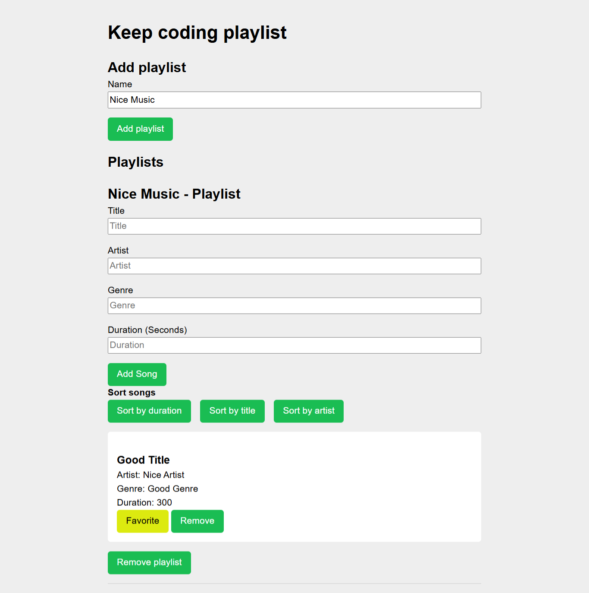

# JavaScript Introduction Project Submission

**KeepCoding Projects - Web 18**  
See the full list of repositories and descriptions at [repos-kc-web-18.md](https://github.com/pablo-sch/pablo-sch/blob/main/docs/repos-kc-web-18.md)

## Select Your Language

- 🇺🇸 [English](README.md)
- 🇩🇪 [German](README.de.md)

<!-- ------------------------------------------------------------------------------------------- -->

## Project Objective

This project aims to practice and demonstrate the knowledge acquired in the virtual classes by applying basic JavaScript concepts as an introduction to web programming. It is not allowed to use external JavaScript or CSS libraries/frameworks; everything must be solved using only “vanilla JS”. This way, each exercise faithfully reflects what was covered in class and provides a hands-on introduction to web development.

<!-- ------------------------------------------------------------------------------------------- -->

## Description

In this repository, you will find the practice exercises for the **“Introduction to JavaScript”** unit. It contains six exercises covering:

- **Strings**, **Arrays**, **Objects**, and their attributes.
- Handling **asynchrony** and **destructuring**.
- Creation and use of **functions**.
- Array methods such as **`.map`**, **`.find`**, and **`.filter`**.
- A small set of unit tests at the end of exercise 06.

Each exercise must be solved without relying on any external library or framework, in order to reinforce the understanding of core JavaScript syntax and techniques.

<!-- ------------------------------------------------------------------------------------------- -->

## Knowledge Acquired and Practiced

| **Category**                        | **Subtopics / Details**                                                                                                                                                                       |
| ----------------------------------- | --------------------------------------------------------------------------------------------------------------------------------------------------------------------------------------------- |
| Introduction to JavaScript          | –                                                                                                                                                                                             |
| Syntax and Variables                | Basic file structure; Reserved words; Comments; Variable declaration (`let`, `const`, `var`); Semicolon                                                                                       |
| Data Types                          | Primitives; Number (`42`, `3.14159`); String (`"Howdy"`); Boolean (`true`, `false`); `null`; `undefined`; BigInt (`9007199254740992n`); Object; Non-zero values, `0`, `null`, and `undefined` |
| Operators                           | `typeof`; Assignment operators; Arithmetic operators; Comparison operators; String operators; Logical operators; Comma operator                                                               |
| Control Statements and Blocks       | –                                                                                                                                                                                             |
| Conditional Expressions (`if…else`) | –                                                                                                                                                                                             |
| Blocks                              | –                                                                                                                                                                                             |
| Hoisting                            | –                                                                                                                                                                                             |
| `switch`                            | –                                                                                                                                                                                             |
| Ternary Operator                    | –                                                                                                                                                                                             |
| Truthy Values                       | Numbers not equal to `0`; Strings not equal to `""`; Objects; Functions                                                                                                                       |
| Falsy Values                        | `false`; `0`; `""` or `''`; `null`; `undefined`; `NaN`                                                                                                                                        |
| Strings and Arrays                  | String methods: `trim()`, `toLowerCase()`, `includes()`, `replace()`, parsing; Error handling; Array methods; Two-dimensional arrays                                                          |
| Functions                           | Function declaration; Arrow functions; Function invocation; Scope; Closures; Default parameters; Rest parameters                                                                              |
| Loops                               | `for`; `while`; `break` and `continue`; `for…in`                                                                                                                                              |
| Objects                             | Object creation; Accessing properties; Modifying properties; Adding properties; Deleting properties; Iteration with `for…in`                                                                  |
| Mutability                          | Mutable objects and arrays; Spread operator (`...`); Destructuring; Reference-related issues                                                                                                  |
| Functional Programming              | Callback functions; `forEach`; `map`; `filter`; `reduce`                                                                                                                                      |
| Asynchrony                          | Asynchronous callbacks; Promises (`Promise`); `async` / `await`                                                                                                                               |
| Additional Topics                   | Dates (`Date`); Regular expressions (RegEx); Modules (ES Modules)                                                                                                                             |

<!-- ------------------------------------------------------------------------------------------- -->

## Project Details

### Note

- The exercise statements and the code shown have been created by the docent **Kevin Martinez**.

### General Considerations

- The use of libraries is not allowed. All code must be created by the student.
- It is not necessary to create a separate HTML file for each solution.

### Exercise 1

- Create a file named `ejercicio1.js` containing an object called `usuario` with the following fields:
  - First name (real or invented)
  - Last name (real or invented)
  - A list of bootcamp topics for Node.js, Git, and React, each with:
    - Module name
    - Start date in `YYYY-MM-DD` format
  - A boolean flag indicating whether you are actively looking for work (`true` or `false`)
- In this file, display on the screen the start date of the React module from the `usuario` object.

### Exercise 2: Fix a Bug

- The client is trying to calculate the average of a list of numbers, but their code in production does not work.
- The error is not provided—only the code being used by the client is available.
- Create a file named `bug.js` with a solution that corrects the average calculation.

```javascript
// exercise2.js

const calculateAverage = (numbers) => {
  let totalSum = 0;
  for (let i = 0; i <= numbers.length; i++) {
    totalSum += numbers[i];
  }
  const average = totalSum / numbers.length;
  return average;
};

const numberList = [1, 2, 3, 4, 5];
const averageOfNumbers = calculateAverage(numberList);
```

### Exercise 3: Deduce the Logic

- There is no problem statement; you must deduce what is expected by examining the input data and the resulting output.

1. **Exercise 3.1**: Create a function that, given the provided input data (not shown here), produces the expected results.

```javascript
// exercise3.1.js

const input1 = ["Downloads", "Videos", "capture", "mp4"];
// create your function here
yourFunction(input1); // 'Downloads/Videos/capture.mp4'
const input2 = ["CodinGame", "python", "py"];
yourFunction(input2); // 'CodinGame/python.py'
const input3 = [
  "programming",
  "languages",
  "easy",
  "beginner",
  "useful",
  "pythonstuff",
  "py",
];
yourFunction(input3);
// 'programming/languages/easy/beginner/useful/pythonstuff.py'
```

2. **Exercise 3.2**: Create a function that, given the provided input data, produces the expected results.

```javascript
// exercise3.2.js

// create your function here
yourFunction(input); // '1-0'
const secondInput = 1;
yourFunction(input); // '1'
const thirdInput = 11234;
yourFunction(input); // '1-1-2-3-4'
```

3. **Exercise 3.3**: Create a function that, given the provided input data, produces the expected results.

```javascript
// exercise3.3.js

// create your function here
const input1 = "string";
// create your function here
yourFunction(input); // '6 gnirts'
const input2 = "variable";
yourFunction(input); // '8 elbairav'
const input3 = "pointer";
yourFunction(input); // '7 retniop'
```

### Exercise 4: Transformations with `map` and `filter`

- The client has an array of data and needs:
  - A list of developers whose skills include `"JavaScript"`.
  - A list of the projects in which their developers work.
- Create a file named `transform.js` containing two functions that return these values.
- **Do not use `for` or `while`; this exercise is designed to practice using `map` and `filter`.**

  ```javascript
  // exercise4.js

  const data = [
    {
      id: 1,
      name: "Juan",
      skills: ["JavaScript", "HTML", "CSS"],
      projects: [
        { id: 1, name: "Project 1" },
        { id: 2, name: "Project 2" },
      ],
    },
    {
      id: 2,
      name: "María",
      skills: ["Python", "SQL", "Django"],
      projects: [
        { id: 3, name: "Project 3" },
        { id: 4, name: "Project 4" },
      ],
    },
    {
      id: 3,
      name: "Pedro",
      skills: ["Java", "Spring", "Hibernate"],
      projects: [
        { id: 5, name: "Project 5" },
        { id: 6, name: "Project 6" },
      ],
    },
  ];
  ```

  ```javascript
  // exercise4.js

  // javascriptDevelopers
  [
    {
      id: 1,
      name: "Juan",
      skills: ["JavaScript", "HTML", "CSS"],
      projects: [
        { id: 1, name: "Project 1" },
        { id: 2, name: "Project 2" },
      ],
    },
  ][
    // projectNames
    ("Project 1",
    "Project 2",
    "Project 3",
    "Project 4",
    "Project 5",
    "Project 6")
  ];
  ```

### Exercise 5: Fix an Asynchrony Bug

- There is an error: when requesting a user with ID 1, the result is always `undefined`.
- The code to review and fix is provided.
- Create a file named `bugAsync.js` with a solution that corrects the asynchronous call.

  ```javascript
  // exercise5.js

  // This program simulates an asynchronous call to retrieve a user
  function getUser(id) {
    let user;
    setTimeout(() => {
      if (id === 1) {
        user = { id: 1, name: "John Doe" };
      }
    }, 2000);
    return user;
  }
  const user = getUser(1);
  console.log(user);
  ```

### Exercise 6: KeepCoding Playlist

- The client has already created the layout and part of the logic for form interactions (sorting, marking as favorite, deleting), but they need help managing the state and complete application logic.
- Requirements:
  - Create a state within a function using **closures**.
  - Export this function to manage the app’s features.
- The file to modify is already located at `playlist/js/playlist.js`; only that file needs editing.
- Each playlist consists of:
  - Playlist name
  - A list of songs, where each song includes:
    - Title
    - Artist name
    - Musical genre
    - Duration in seconds
    - A boolean indicating whether it is marked as “favorite”

<!-- ------------------------------------------------------------------------------------------- -->

## Technologies Used

### Languages

- **HTML**: For structuring content and building the page layout.
- **CSS**: For design and visual styling, ensuring an attractive and consistent user experience.
- **JavaScript**: For adding interactivity and dynamic features to the website, enhancing user experience with form validation, animations, and event handling.

### Dependencies

None

<!-- ------------------------------------------------------------------------------------------- -->

## Installation and Usage Instructions

### Software Requirements

- **[Git](https://git-scm.com/downloads)** (tested with version **2.47.1.windows.1**)
- **[Visual Studio Code](https://code.visualstudio.com/)** (tested with version **1.99.0**)
- **Live Server** (VS Code addon)

### Cloning the Repository

Clone the project:

```bash
git clone https://github.com/pablo-sch/keepcoding-01-javascript-basics.git
```


<!-- ------------------------------------------------------------------------------------------- -->

## Project Preview

### Exercise 6: Playlist



<!-- ------------------------------------------------------------------------------------------- -->

## Contribuciones y Licencias

Este proyecto no cuenta con contribuciones externas ni licencias.
